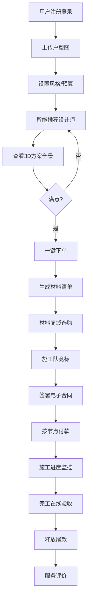

## 1. 产品概述

筑家 - 大型室内设计与装修一站式服务平台，连接业主、设计师、施工队和材料供应商，提供从户型设计到完工验收的全流程数字化服务。解决装修行业信息不对称、过程不透明、预算难控制等痛点。

## 2. 核心功能

### 2.1 用户角色

| 角色 | 注册方式 | 核心权限 |
|------|----------|----------|
| 业主用户 | 手机号/邮箱注册 | 上传户型图、选择设计师、浏览方案、下单、购买材料、监控施工、申请分期 |
| 设计师 | 资质认证入驻 | 接收需求、提交方案、管理订单、查看评价 |
| 施工队 | 资质认证入驻 | 参与竞标、签署合同、上报进度、接收款项 |
| 材料供应商 | 企业认证入驻 | 上架商品、管理订单、查看销售数据 |
| 平台管理员 | 后台账号登录 | 数据看板、用户管理、订单监控、报表导出、系统配置 |

### 2.2 功能模块

1. **首页**: 导航栏、Banner轮播、热门设计师推荐、精选案例、材料促销
2. **智能匹配**: 户型图上传、风格偏好选择、预算设置、设计师智能推荐
3. **设计方案**: 设计师列表、3D效果图展示、720度全景预览、方案对比、一键下单
4. **材料商城**: 分类导航、品牌筛选、商品详情、购物车、订单管理
5. **施工管理**: 施工队竞标、电子合同签署、付款节点设置、进度跟踪、在线验收
6. **装修分期**: 额度评估、还款计划、申请流程、分期管理
7. **个人中心**: 用户信息、我的订单、我的收藏、消息通知、评价管理
8. **管理看板**: 实时数据概览、设计师活跃度、订单统计、施工进度监控、材料销量分析、用户满意度、预测分析、报表导出

### 2.3 页面详情

| 页面名称 | 模块名称 | 功能描述 |
|---------|---------|----------|
| 首页 | Banner区域 | 自动轮播展示平台活动、热门推荐 |
| 首页 | 快捷入口 | 户型上传、找设计师、逛商城、看案例图标入口 |
| 首页 | 设计师推荐 | 卡片式展示热门设计师，支持按评分/接单量排序 |
| 首页 | 精选案例 | 瀑布流展示装修案例，支持点击查看详情 |
| 智能匹配页 | 户型上传 | 支持图片上传、拖拽上传，自动识别户型轮廓 |
| 智能匹配页 | 偏好设置 | 风格选择(现代/北欧/中式等)、预算区间、面积填写 |
| 智能匹配页 | 推荐结果 | 算法匹配设计师列表，显示匹配度、报价、评分 |
| 设计师详情页 | 设计师信息 | 头像、简介、资质、评分、接单量 |
| 设计师详情页 | 作品集 | 3D效果图网格展示，支持点击放大查看 |
| 设计师详情页 | 全景预览 | 720度全景漫游，支持陀螺仪/手势控制 |
| 设计师详情页 | 评价区 | 用户评价列表、评分统计 |
| 材料商城页 | 分类导航 | 左侧分类树，支持多级分类展开 |
| 材料商城页 | 筛选栏 | 品牌筛选、价格区间、规格选择 |
| 材料商城页 | 商品列表 | 卡片式展示，支持加入购物车/立即购买 |
| 订单确认页 | 材料清单 | 自动根据设计方案生成所需材料清单 |
| 订单确认页 | 预算计算 | 自动计算总价，显示优惠信息 |
| 施工竞标页 | 竞标列表 | 显示参与竞标的施工队信息、报价、工期 |
| 施工竞标页 | 施工队详情 | 资质展示、过往案例、用户评价 |
| 合同签署页 | 合同预览 | 电子合同内容展示，支持滚动查看 |
| 合同签署页 | 签名区域 | 手写签名输入框，签署后生成法律效力合同 |
| 施工进度页 | 进度时间轴 | 可视化展示施工节点完成情况 |
| 施工进度页 | 现场照片 | 监理上传的现场照片墙，支持点击放大 |
| 施工进度页 | 进度报告 | 监理提交的文字报告列表 |
| 验收页 | 验收项清单 | 逐项验收检查项，支持通过/不通过标记 |
| 验收页 | 尾款确认 | 验收通过后确认释放尾款 |
| 分期申请页 | 额度评估 | 填写信息后自动评估可贷额度 |
| 分期申请页 | 还款计划 | 不同期数的月供展示，支持选择 |
| 个人中心页 | 用户信息 | 头像、昵称、基本信息编辑 |
| 个人中心页 | 订单管理 | 全部订单列表，支持按状态筛选 |
| 个人中心页 | 我的收藏 | 收藏的设计师、案例、商品 |
| 管理看板首页 | 数据概览 | 总用户数、今日订单、总营收、在施工地等核心指标 |
| 管理看板首页 | 图表区域 | 订单趋势图、设计师活跃度排行、材料销量排行 |
| 管理看板首页 | 实时监控 | 施工进度预警、待处理事项列表 |
| 数据分析页 | 筛选条件 | 按城市、时间范围筛选数据 |
| 数据分析页 | 预测分析 | 下季度热门风格预测、材料需求预测 |
| 报表导出页 | 报表列表 | 月度运营报表、设计师绩效报表、施工队评分报表 |
| 报表导出页 | 导出配置 | 选择导出格式(PDF/Excel)、时间范围 |

## 3. 核心流程

### 3.1 装修全流程

用户注册登录 → 上传户型图 → 设置风格偏好和预算 → 系统智能推荐设计师 → 查看设计师方案和3D全景 → 满意后下单 → 系统生成材料清单和预算 → 材料商城选购 → 施工队竞标选择 → 签署电子合同 → 按节点付款 → 施工过程中接收监理照片和报告 → 完工在线验收 → 确认释放尾款 → 评价设计师和施工队

### 3.2 管理员运营流程

管理员登录 → 查看实时数据看板 → 监控设计师活跃度和订单量 → 跟踪施工进度 → 分析材料销量和用户满意度 → 查看系统预测的热门风格和材料需求 → 调整推荐策略 → 导出月度运营报表

## 4. 用户界面设计

### 4.1 设计风格

- **主色调**: 深胡桃木色 (#3E2723) 作为主色，体现家居装修的温馨质感
- **辅助色**: 暖金色 (#FFB300) 作为点缀色，营造高端品质感
- **背景色**: 米白色 (#FAFAFA) 作为主背景，浅灰色 (#F5F5F5) 作为卡片背景
- **按钮风格**: 圆角矩形按钮，主按钮使用深胡桃木色配金色文字，悬停时有微发光效果
- **字体**: 标题使用 "Noto Serif SC" 宋体类字体体现品质感，正文使用 "Noto Sans SC" 无衬线字体保证可读性
- **布局风格**: 卡片式布局，大留白，适当的阴影和圆角，营造高级感
- **图标风格**: 线性图标，统一2px描边，金色强调色

### 4.2 页面设计概述

| 页面名称 | 模块名称 | UI元素 |
|---------|---------|--------|
| 首页 | Hero区域 | 全屏背景图，大标题使用衬线字体，渐入动画 |
| 首页 | 快捷入口 | 图标卡片，悬停时上浮效果，金色描边 |
| 设计师详情页 | 全景预览 | 沉浸式查看器，陀螺仪控制提示，热点标记 |
| 材料商城页 | 商品卡片 | 图片hover放大效果，价格标签金色背景 |
| 施工进度页 | 时间轴 | 竖线连接节点，完成节点金色填充，未完成灰色轮廓 |
| 管理看板 | 数据卡片 | 深色背景，金色数字，发光效果 |
| 管理看板 | 图表区域 | 渐变填充图表，金色数据点 |

### 4.3 响应式

- Desktop-first 设计，优先保证1920px大屏体验
- 适配1440px、1024px等主流桌面分辨率
- 平板端(768px)调整布局，侧边栏转为顶部导航
- 移动端(375px)简化布局，底部Tab导航，优化触控区域

### 4.4 3D场景指导

- **环境**: 使用暖色调HDRI，模拟室内自然光效果
- **灯光**: 三点布光，主光暖白色，辅光冷白色，轮廓光金色
- **相机**: 默认透视视角，支持自动旋转展示，用户可拖拽控制
- **交互**: 点击家具显示信息面板，切换不同材质方案预览
- **后处理**: 轻微泛光效果，色彩分级，提升画面质感
