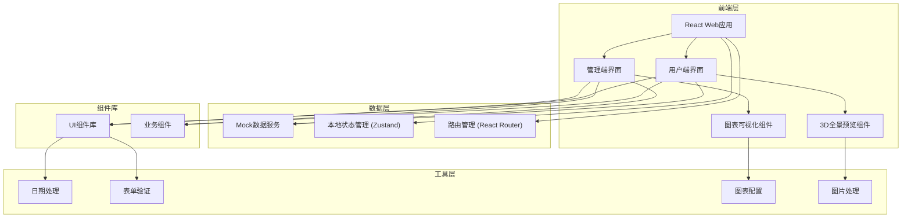
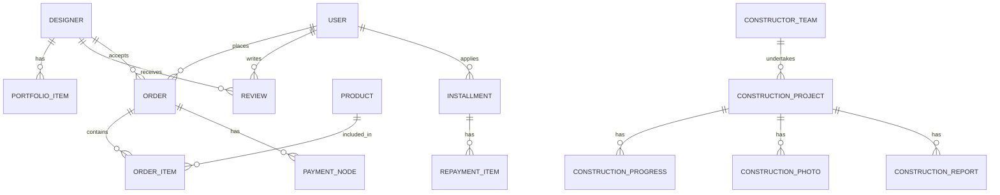

## 1. 架构设计



## 2. 技术描述

- **前端框架**: React@18 + TypeScript
- **构建工具**: Vite@5
- **样式方案**: TailwindCSS@3
- **路由管理**: React Router DOM@6
- **状态管理**: Zustand
- **图表库**: Recharts
- **UI组件**: 自定义组件 + Lucide React图标
- **3D全景**: 使用CSS 3D Transform + 全景图片模拟
- **日期处理**: date-fns
- **表单处理**: React Hook Form

## 3. 路由定义

| 路由 | 页面 | 用途 |
|------|------|------|
| / | 首页 | 平台首页，展示推荐内容 |
| /match | 智能匹配 | 户型上传、偏好设置、设计师推荐 |
| /designers | 设计师列表 | 浏览全部设计师 |
| /designer/:id | 设计师详情 | 查看设计师信息、作品集、全景预览 |
| /mall | 材料商城 | 建材商品浏览、筛选、购买 |
| /mall/product/:id | 商品详情 | 查看商品详情、加入购物车 |
| /mall/cart | 购物车 | 购物车管理、结算 |
| /orders | 我的订单 | 订单列表、订单详情 |
| /construction | 施工管理 | 施工竞标选择、合同签署 |
| /construction/:id/progress | 施工进度 | 进度查看、照片报告查看 |
| /construction/:id/acceptance | 验收 | 在线验收、尾款确认 |
| /installment | 装修分期 | 额度评估、还款计划、分期申请 |
| /profile | 个人中心 | 用户信息、我的收藏、评价管理 |
| /admin | 管理看板首页 | 数据概览、核心指标 |
| /admin/analytics | 数据分析 | 筛选、预测分析、趋势图表 |
| /admin/reports | 报表导出 | 月度报表、绩效报表、导出配置 |
| /login | 登录 | 用户/管理员登录 |
| /register | 注册 | 用户注册 |

## 4. 数据类型定义

```typescript
// 用户相关
interface User {
  id: string;
  name: string;
  phone: string;
  email: string;
  avatar: string;
  role: 'owner' | 'designer' | 'constructor' | 'supplier' | 'admin';
  createdAt: string;
}

// 设计师
interface Designer {
  id: string;
  name: string;
  avatar: string;
  title: string;
  styles: string[];
  rating: number;
  orderCount: number;
  priceRange: { min: number; max: number };
  description: string;
  portfolio: PortfolioItem[];
  reviews: Review[];
  matchScore?: number;
}

// 作品集
interface PortfolioItem {
  id: string;
  title: string;
  style: string;
  area: number;
  budget: number;
  coverImage: string;
  images: string[];
  panoramaUrl?: string;
}

// 评价
interface Review {
  id: string;
  userId: string;
  userName: string;
  userAvatar: string;
  rating: number;
  content: string;
  images: string[];
  createdAt: string;
}

// 商品
interface Product {
  id: string;
  name: string;
  brand: string;
  category: string;
  price: number;
  originalPrice: number;
  images: string[];
  description: string;
  specs: Record<string, string>;
  stock: number;
  sales: number;
}

// 订单
interface Order {
  id: string;
  orderNo: string;
  type: 'design' | 'material' | 'construction';
  status: 'pending' | 'paid' | 'processing' | 'completed' | 'cancelled';
  totalAmount: number;
  items: OrderItem[];
  createdAt: string;
  paymentNodes?: PaymentNode[];
}

interface OrderItem {
  id: string;
  name: string;
  type: string;
  price: number;
  quantity: number;
  image: string;
}

interface PaymentNode {
  id: string;
  name: string;
  amount: number;
  percentage: number;
  status: 'pending' | 'paid';
  deadline: string;
}

// 施工项目
interface ConstructionProject {
  id: string;
  orderId: string;
  name: string;
  address: string;
  area: number;
  constructor: ConstructorTeam;
  status: 'bidding' | 'contract' | 'constructing' | 'acceptance' | 'completed';
  progress: ConstructionProgress[];
  photos: ConstructionPhoto[];
  reports: ConstructionReport[];
  timeline: ProjectTimeline[];
}

interface ConstructorTeam {
  id: string;
  name: string;
  leaderName: string;
  phone: string;
  rating: number;
  completedProjects: number;
  bidPrice: number;
  bidDays: number;
}

interface ConstructionProgress {
  id: string;
  name: string;
  status: 'pending' | 'in_progress' | 'completed';
  startDate?: string;
  endDate?: string;
}

interface ConstructionPhoto {
  id: string;
  url: string;
  description: string;
  uploadedBy: string;
  uploadedAt: string;
}

interface ConstructionReport {
  id: string;
  title: string;
  content: string;
  submittedBy: string;
  submittedAt: string;
}

interface ProjectTimeline {
  id: string;
  title: string;
  description: string;
  date: string;
  status: 'completed' | 'current' | 'pending';
}

// 分期
interface Installment {
  id: string;
  userId: string;
  amount: number;
  term: number;
  monthlyPayment: number;
  interestRate: number;
  status: 'pending' | 'approved' | 'rejected' | 'completed';
  repaymentPlan: RepaymentItem[];
}

interface RepaymentItem {
  period: number;
  amount: number;
  principal: number;
  interest: number;
  dueDate: string;
  status: 'pending' | 'paid' | 'overdue';
}

// 管理看板数据
interface DashboardStats {
  totalUsers: number;
  todayOrders: number;
  totalRevenue: number;
  activeProjects: number;
  userSatisfaction: number;
  designerActiveCount: number;
  materialSales: number;
}

interface TrendData {
  date: string;
  orders: number;
  revenue: number;
}

interface RankingItem {
  id: string;
  name: string;
  value: number;
  avatar?: string;
}

interface PredictionData {
  style: string;
  trend: 'up' | 'down' | 'stable';
  percentage: number;
}
```

## 5. 数据模型

### 5.1 ER图



### 5.2 核心数据初始化

系统将使用Mock数据进行演示，包括：
- 10位设计师数据，包含不同风格和价位
- 50+建材商品，覆盖地板、瓷砖、涂料、灯具等分类
- 20+施工案例数据
- 模拟的订单、进度、评价数据
- 管理看板的统计和趋势数据
